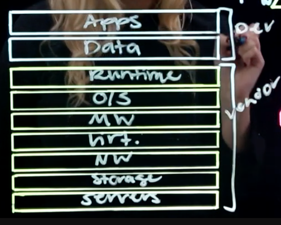
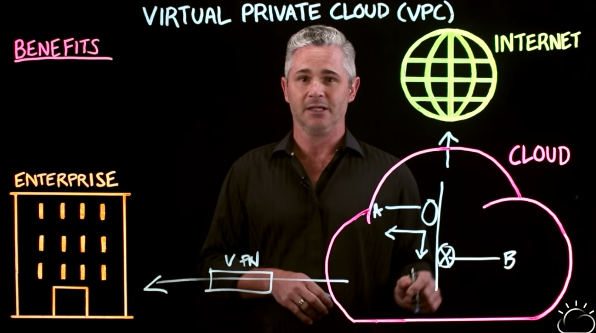
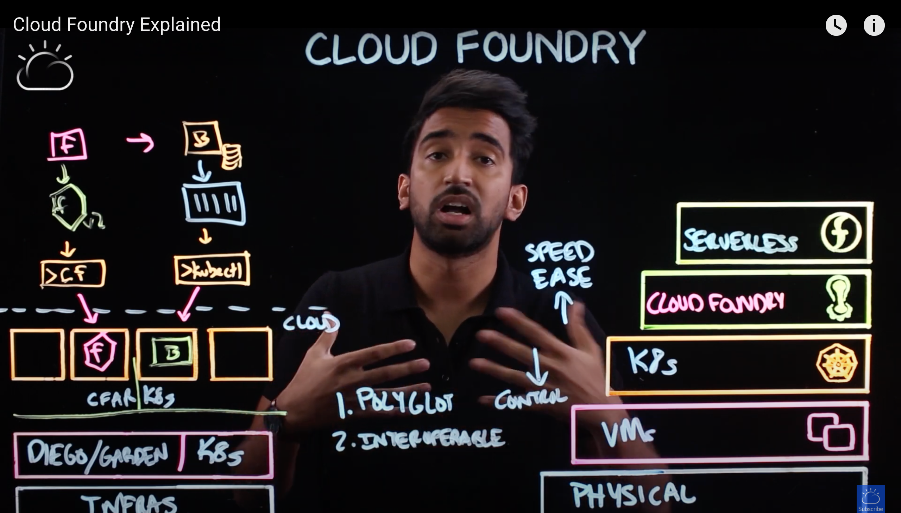

> ibm CLouders로 활동하면서 ibm CLoud Essentials 강의 들으며 note taking한 거 공유하는 글이다. 클라우드의 개략적인 개념을 이해할 수 있어서 좋았다.

# Iaas / Paas / Saas

aaS = as a Service, how you consume

* Iaas : Infrastructure. For example, my computer, some random other person's computer running somewhere else ... 
  * persona of Iaas is "System admin"
  * It's like a "leasing a car"
* Paas : Platform.
  * persona is "Developer"
  * renting a car 
* Saas : Software
  * taking taxi / Uber

___

# Cloud Native

Microservice, Container를 Cloud native application으로 개발 

___

# Infrastructure as a Service

* Bare Metal Server ? 
  * A dedicated physical server which is yours to use and manage from the 'metal up'
  * No sharing of underlying hardware

## Virtual Private Cloud (VPC)

 traditional cloud works like this. Network engineers have to do all network system things. routers, VPN, ... 

However <<Virtual Networking>> , all of these capabilities is given as a service. User can create these functions and the segmentation with a UI or CLI or API without knowing any proprietary interfaces. 

VPC is isolated logical network that you create. this includes Multi Region Zone(MZR), Sequrity Groups , Connectivity. Other services are provided to support VPC like Load Balancing. 

## VMWare

What IBM cloud gives:

* Data sovereignty compliance - Geo-Fencing for workloads,  Data doeson't cross borders
* Compliance and regulatory control

___

# Platform as a Service

There's a lot of technologies for doing cloud-native transformation.

Let's see from the bottom with bare-bones physical infrasturcture. 

legacy applications > VMs > Kubernates > **Cloud Foundry** > Serverless

## Cloud Foundry

very developer focused approach. increased speed & ease. For example, what developer would do with cloud foundry is like this. Let's say you developed front application with react. You can deploy app with CLI tool CF(cloud foundry). Cloud Foundry takes your app and runs your app with the environment of cloud. You don't need to care about security, infrastructure. Then if you are to change your backend application into container, you can use CLI tool **kubectl** to deploy to cloud. Backend container & front app are running in the same environnment. 

## Container Orchestration 

> Before starting, Let's look at quick explanation of "Container". A container is a unit of software that contains all the components required to run and application, including all its dependencies, libraries, other binaries and so on.

Let's look at what container orchestration platform like k8s does. It uses "Worker node" just like vm, computer. 

1. Deploy
2. Scaling
3. Network (ex. with scaling, platform should do load-balancing and connect other microservices)
4. Insight (logging, anaylitics, ...)

## Red Hat OpenShift

OpenShift is a platform as a service offering from Red Hat, built on Kubernates technology. OpenShift simplifies the use of Kubernetes by taking away many of the decisions that normally need to be made when using Kubernetes. As an example, a developer, can concentrate on creating application code and let OpenShift create all the Kubernetes configuration by using the Source to Image workflow, which takes your code from a git repository, builds the container then deploys it to OpenShift autogenerating all the deployment configuration needed.

When application or project was created, OpenShift in the backend will create a Jenkins job and pipeline. So all developers need to do is push their code changes to repository(ex. Github). 

1. Developer push changes to repository
2. Webhook is triggered, then kicks off a Jenkins job.
3. Jenkins job will create "Sourced image", which means creating a Docker image out of that source code.
4. Take this and put it into a private restiry.
5. OpenShift will push this into a cluster.
6. Bring down the old version, and start the new version.

## KNatvie

It is the platform that on top of kubernetes, supports function serverless. We have three components on top of kubernetes, BUILD & SERVE & EVENT. With Knative, we can make all build process into one kubernetes cluster. 

___

# Reference

* https://tanzu.vmware.com/kr/cloud-native