> webRTC 프로젝트 시작하기 전, node js로 간단한 webrtc 프로그램을 만들고 ibm cloud foundry로 배포해봤습니다. cli로 뚝딱 되어버려 너무 신기해요.🤔 

# 📌 Table of Contents

- [서론](#서론)
- [IBM Cloud Foundry란?](#ibm-cloud-foundry란)
- [IBM Cloud Foundry 로 배포](#ibm-cloud-foundry-로-배포)
- [reference](#reference)


# 서론

이 글은 간단한 WebRTC Web App을 IBM Cloud Foundry를 사용하여 배포해보고자 한다. 생각보다 매우 간단!

그리고 WebRTC Web App은 기존에 있는 오픈소스를 활용하겠다.

[WebRTC Basic App](https://github.com/agilityfeat/webrtc-video-conference-tutorial/tree/webrtc)


로컬 컴퓨터에서 테스트하면 아래처럼 동작한다.

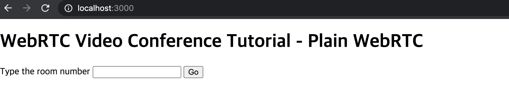

Room Number를 써서 화상 채팅방 만들면 된다. 나는 1을 넣어보겠다.

숫자 넣고 Go하면 내 화면이 뜬다.  짜잔! 방을 만든 썬구리 얼굴이 뜬다.

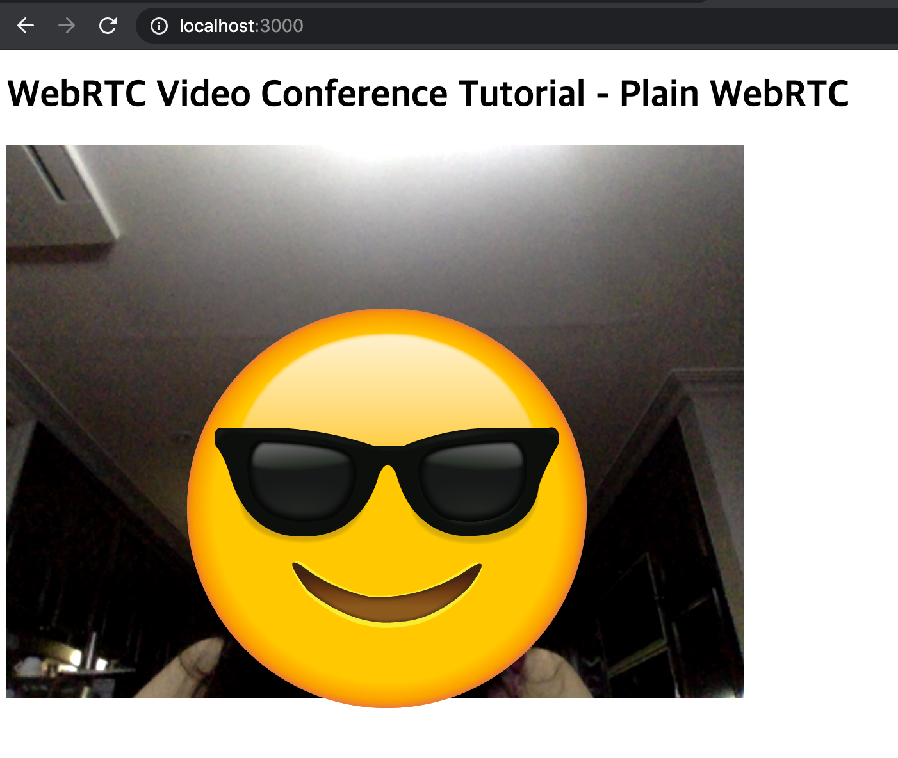

그리고 내가 여기서 다시 localhost:3000을 들어가서 내가 입력했던 채팅방 room number 1로 들어가면, 이제 화상 채팅이 가능해진다. 

요렇게!

썬구리와 윙키가 이제 화상채팅에 성공한 것. 

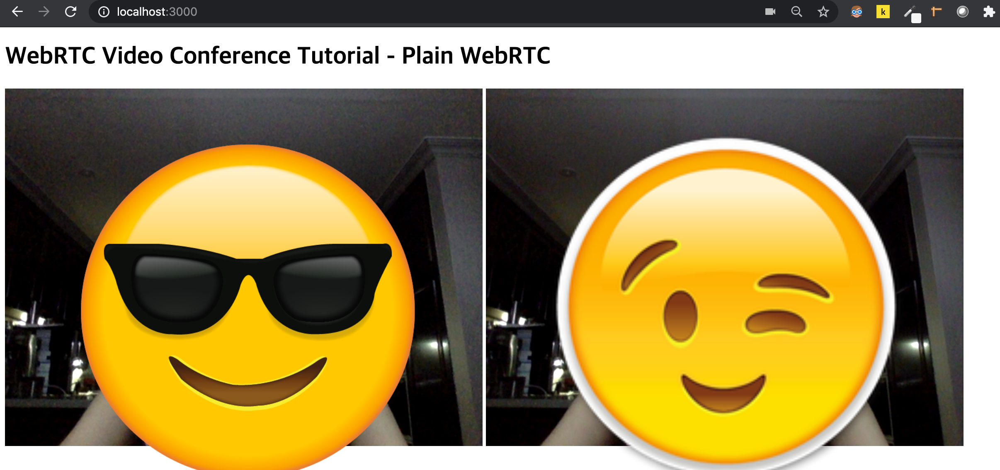


사실은 이게 중요한게 아니라 오늘의 글은 이 간단한 프로그램을 IBM Cloud Foundry를 사용하여 손쉽게 배포해보도록 하는 것이다. 


# IBM Cloud Foundry란?

[IBM Cloud Foundry](https://cloud.ibm.com/docs/cloud-foundry-public?topic=cloud-foundry-public-getting-started)는 클라우드 네이티브 앱을 쉽고 빠르며 안정되게 배치할 수 있는 PaaS(Platform-as-a-Service)이다. Cloud Foundry를 사용하면 코딩의 빌드 및 배치 요소가 연결된 서비스에 맞게 계속 신중하게 조정되므로, 애플리케이션을 빠르고 일관되며 안정되게 반복할 수 있다. 


# IBM Cloud Foundry 로 배포

그럼 IBM Cloud Foundry 로 내가 만든 node js 서버를 간단하게 배포해보고자 한다. 따끈따끈하게 새로 진행했으므로 아래 내용을 따라하면 바로 될 것이다. (IBM Cloud에서 lite계정을 사용하면 무료이므로 비용은 걱정하지 않아도 된다.)

자, 일단 IBM Cloud 대시보드에서 Node JS 리소스를 만든다.

* 리소스 작성 > Cloud Foundry 앱 > Node js 선택

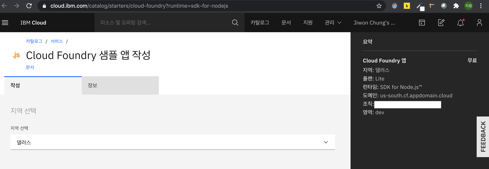

* 이름 대충 정해서 만들면, 실행 중으로 변하면서 뭔가 시작하는 느낌이 든다. 내 대시보드에 가도 내가 만든 앱이 실행 중인 걸 알 수 있다. 

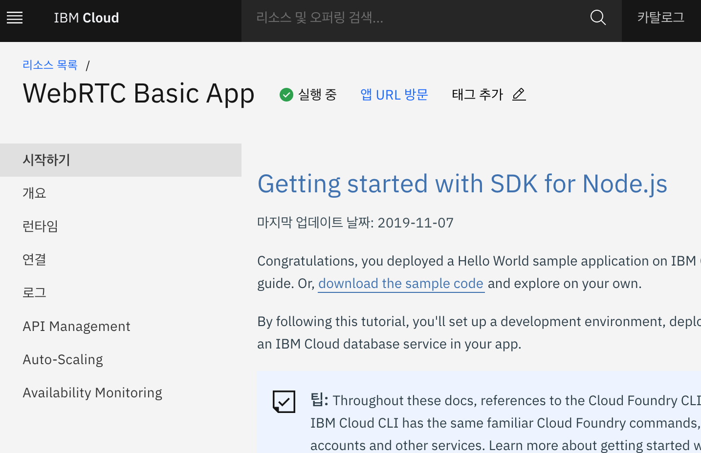

* Cloud Foundry 앱을 사용하기 위해서는 앱의 root 경로에 manifest.yml파일을 만들어 설정해줘야 한다. 아래처럼 하면 되겠다.

```shell
# manifest.yml
applications:
  - name: WebRTC Basic App
    random-route: true
    memory: 64M
```

package.json에는 실행할 명령어를 적는다.

```
# ...
"scripts": {
    "start": "node server.js"   
  }
# ...
```

* 이제 배포하자

  Cloud Foundry cli를 사용해야 하기 때문에 IBM Cloud CLI를 설치한다. 이미 내 맥에는 깔아버렸기 때문에 자세한 설명은 [공식홈페이지](https://cloud.ibm.com/docs/cli?topic=cli-getting-started)를 참고하세요.

  

  ibmcloud login을 CLI로 입력하고, 로그인하면 된다.  지역은 아까 생성한 리소스와 일치시킨다. 나는 댈러스로 선택했으므로 us-south 선택

```shell
ibmcloud login
```

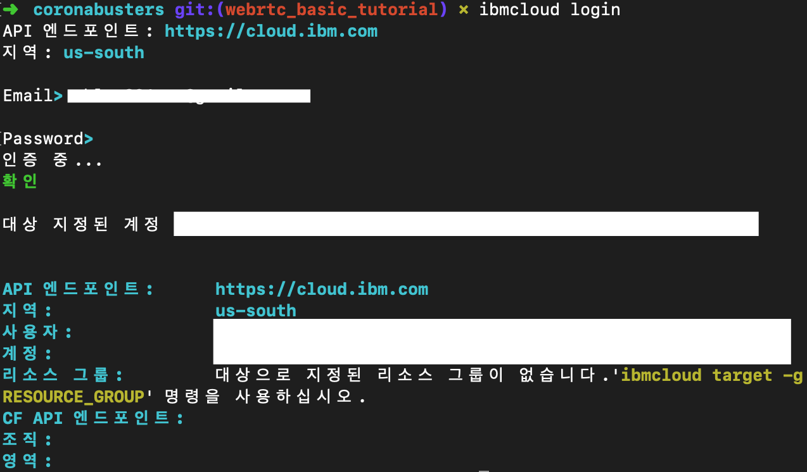

ibmcloud target --cf로 해당 directory와 클라우드를 연결하고, ibmcloud cf push로 리소스를 클라우드에 입력시킨다. 

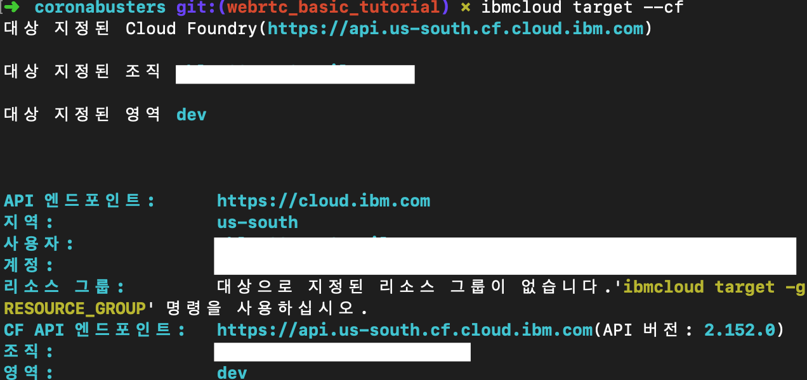

😅 `ibmcloud cf push`는 생각보다 오래걸리므로 좀 기다립시다. 

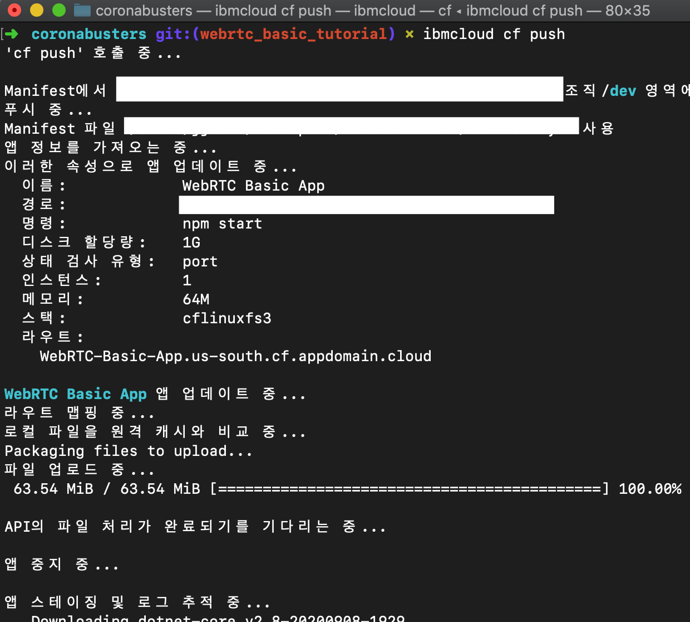

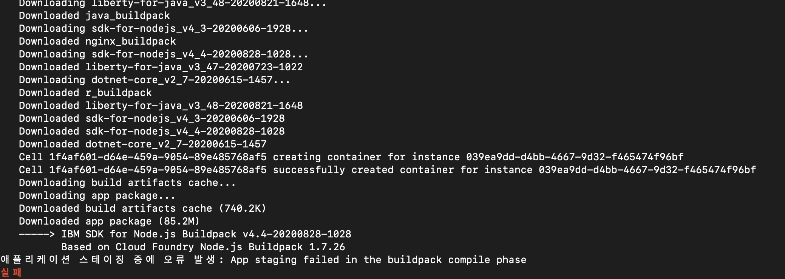

아.. 이런.. package.json에 오류가 있어서 실패했네. 로컬에 그래도 한번 돌려보고 push해야하는데.. 😤 어쨌든 오류 수정하고, 다시 ibmcloud cf push하면 된다.

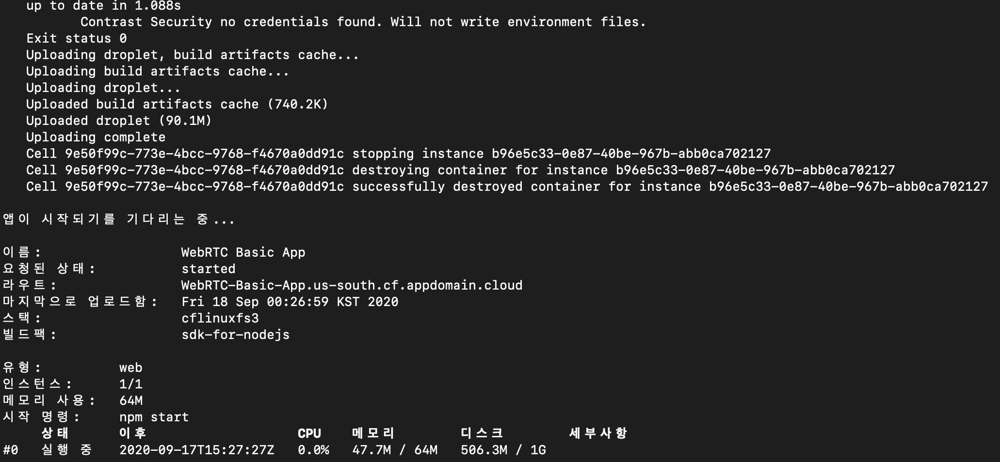

오우 성공! 이제 그럼 ibm cloud 대시보드를 확인해볼까?


* 배포한 앱을 실행해보자

다시 내 리소스를 들어가서 앱URL방문을 클릭해본다. 

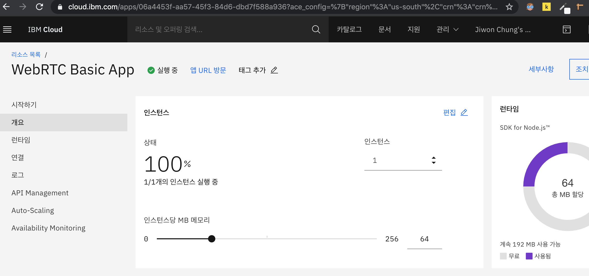

로컬 컴퓨터에서 돌렸던 것과 똑같이 뜬다! 성공!

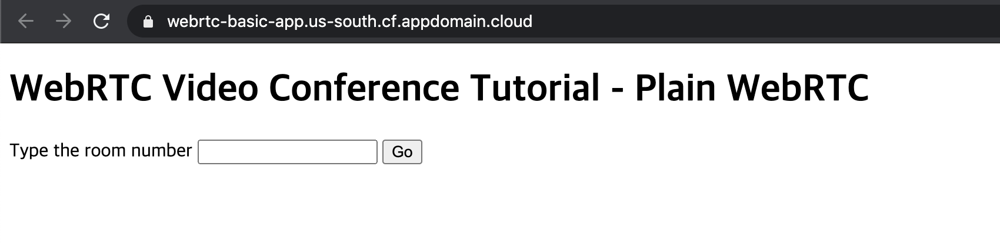


화상 채팅까지 성공하는 지 확인해봅시다.

1번 방을 만들고, 입장

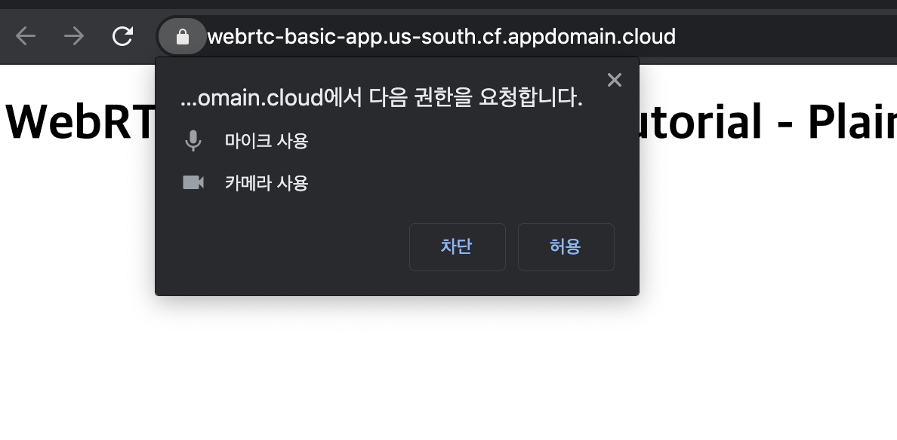


다시 썬구리가 등장한 것을 볼 수 있다.

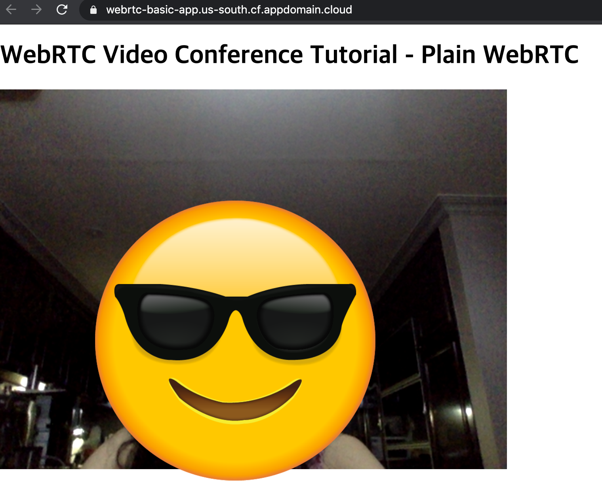

그럼 다시 1번방을 들어가서 화상 채팅 기능을 테스트해보자. 

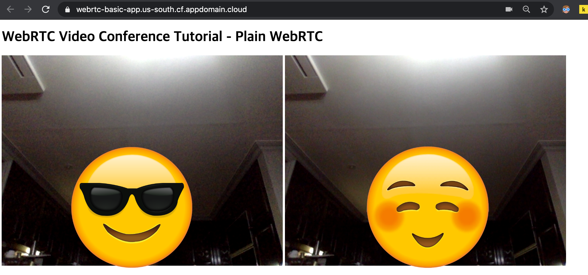

로컬에서 테스트했을 때와 동일하게 동작하는 것을 확인할 수 있다.


🚦 이제 내 로컬 컴퓨터에서 기능 수정하고, 버그 수정하고, 테스트한 다음 ibmcloud cf push만 하면 배포가 가능하다.

# refrerence

* https://lovemewithoutall.github.io/it/deploy-on-ibm-cloud/