---

layout: post
title: "IBM Watson을 이용한 간단한 NLP 실습"
excerpt: "초보자를 위한 NLU 튜토리얼 따라하기"

categories:
  - NLP
tags:
  - NLP, ibmcloud
last_modified_at: 2020-09-18T01:11:00-05:00


---

> IBM Watson Studio 를 이용해서 간단한 NLP 프로그램을 만들어봤습니다. 자연어 처리 한번 해보고 싶었는데, 자연어 처리하면 또 IBM Watson 아니겠어요! NLP에 대한 이해는 아주 적지만 친절한 외쿡 블로그를 따라 하나씩 작성해보았습니다. 
>
> [참고한 친절한 외쿡 블로그 가기](https://medium.com/analytics-vidhya/getting-started-with-notebooks-in-ibm-watson-nlu-part-1-3b0b92894901)
>
> 과연 성공할런지.. 👶🏽

# 📌 Table of Contents

- [뭐 할건가요?](#뭐-할건가요)
- [실습 시작](#실습-시작)


# 뭐 할건가요?

Review DataSet을 IBM Cloud Storage에 올리고, Data를 내가 구현한 노트북에서 좀 변형하고, Watson's API를 사용하여 Review Dataset에서 감정을 추출해 낼 것입니다. Positive review인지, Negative Review인지 말이죠!


# 실습 시작

이번 실습은 [IBM Watson Studio](https://www.ibm.com/cloud/watson-studio)를 사용할 것이기 때문에, IBM Cloud 및 Watson Studio에 가입되어 있다고 전제하고 시작합니다. 


IBM Cloud ID로 로그인하니 뭔가 멋진 그림이 보입니다. 제가 아무 서비스도 사용하지 않아서 뜨는 것 같군요. 🐣

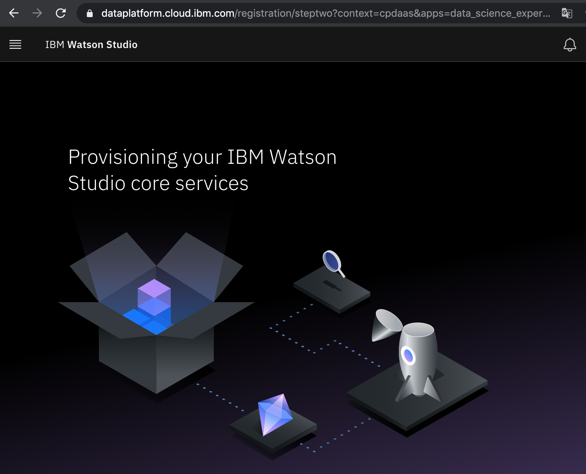


Service Catalog에서 Natural Language Understanding을 누르고, 서비스를 만들어 봅니다. 

참고로 Lite는 한 계정 하나만 사용할 수 있어서, Lite 플랜을 사용하고 있는 앱은 중지해야 합니다. 😨 

짠! 잘 만들면, 요렇게 뜹니다.

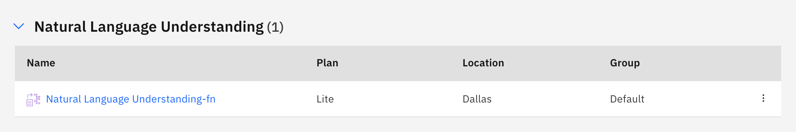


그리고 우리는 Watson NLU 서비스의 API 를 호출할 때 필요한 credentials이 필요해요. 우리가 만든 서비스에 들어가 New Credential을 누릅니다. 

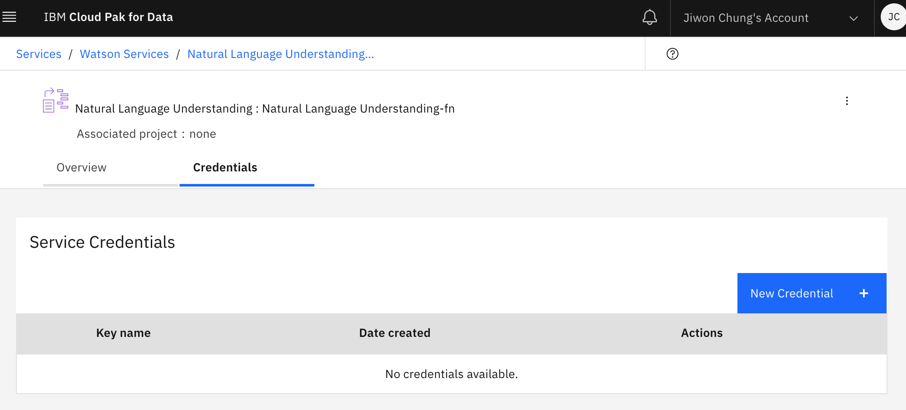

그리고 credential key를 메모장이라든지 잘 보관해두세요. 이름 쓰라고 뜨는데 원하는 이름 쓰면, api key같은 것들이 잔뜩 써진 credential이 생성됩니다. 


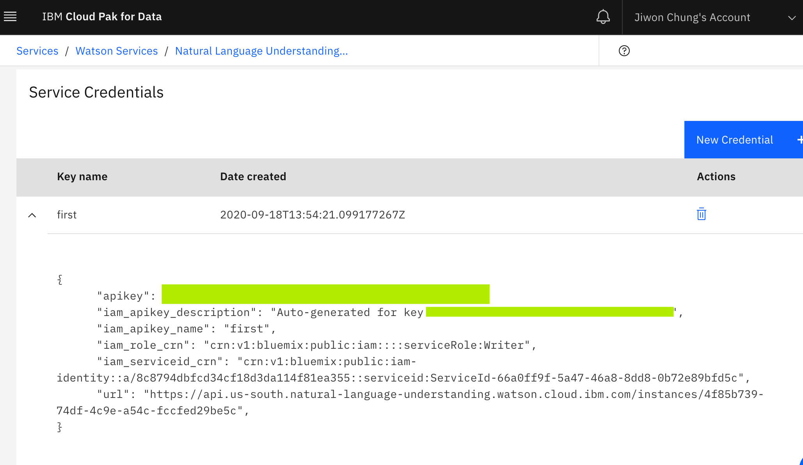

여기서 우리는 api_key 와 url endpoint를 사용할 거에요.


이제 우리 서비스가 만들어졌으니, NLP Project를 빌드해봅시다!


New project > Create an empty project를 눌러 빈 프로젝트를 생성합니다. 

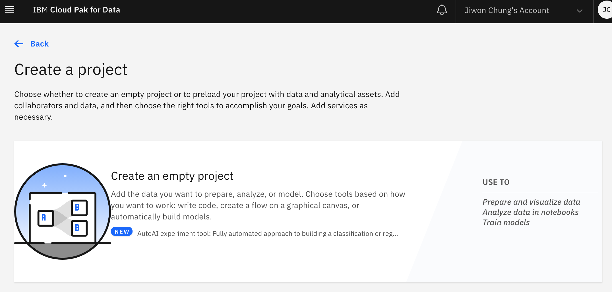


그러고 나면 디테일한 정보들을 입력하라고 하고, Storage를 추가하라고 할거에요. Cloud Object Storage를 사용할건데, IBM Cloud object storage를 Lite플랜으로 만들면 됩니다. 👏🏻 

그러면 이제 project를 생성할 수 있어요. 

> .... 프로젝트 만드는 중....

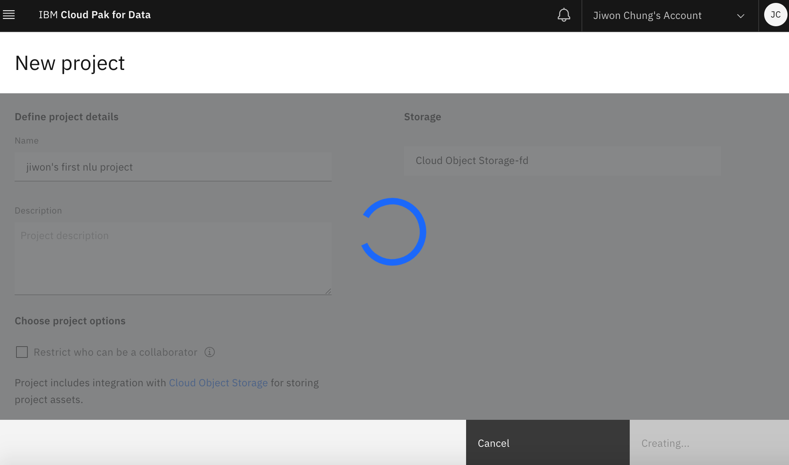


뭔가 만들어지긴 했습니다. 이 대시보드에서 Add to Project를 클릭합니다. 이제 우리 notebook을 여기에 연결할 거에요.

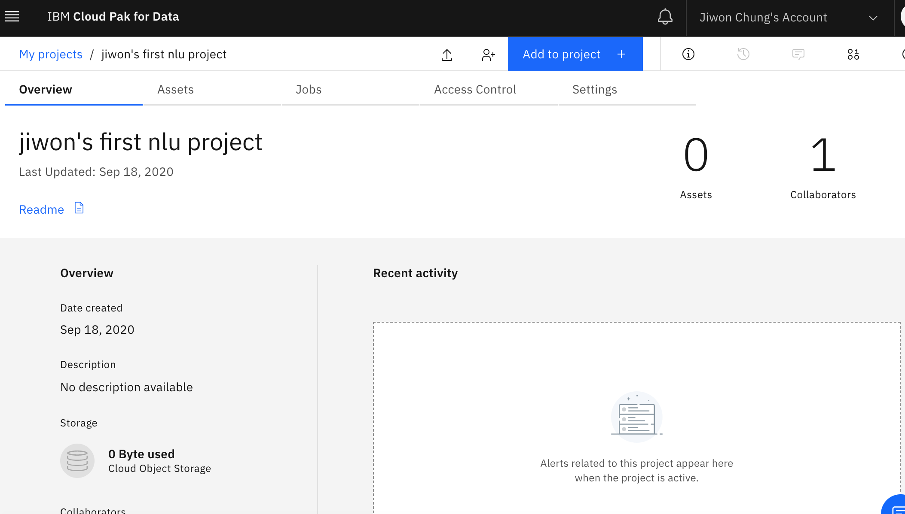


⛔️ 아니.. 왜 저는... Available asset types에 Notebook 이 없죠..? 난관 봉착.

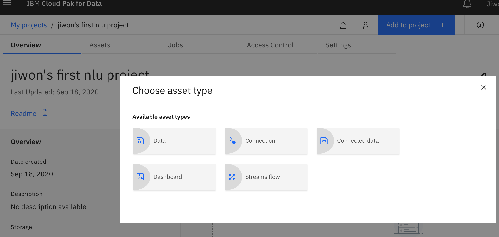


⚠️ watson studio 앱이 생성되어 있지 않아서 였습니다. 아래 페이지에서 상세하게 설명해주고 있으니, 확인해보세요! 서비스 카탈로그에서 watson studio free tier로 생성만 하면 바로 해결되긴 합니다. 

[Notebook is missing. How to fix ?](https://www.ibm.com/support/pages/options-notebook-model-and-so-are-missing-add-project-watson-studio)


휴, 이제 다시 노트북을 생성할 수 있으니 생성해봅니다. 


노트북이 정말 더럽게 안만들어지네요. 공지 보니 9/18일 Dallas 지역 뭐가 안된다고 써있는 것 같긴 한데...🤬 계속 Start 를 실패하고, Load실패하고... 난리 부르스. 

드디어 성공. 하여튼 이제부터 코드를 작성하면 되는데, 일단 이번엔 watson nlu api를 써보는게 목적이므로 친절한 외국 블로그의 코드를 따라 해보겠습니다. 


앗, 일단 코딩 하기전에 Data Set을 업로드 합니다. Add to Project > Data를 누르고, 파일을 drag&drop하면 됩니다. 

당연히 Dataset은 저 외국블로그에서 다운받으면 되겠죠~🙄

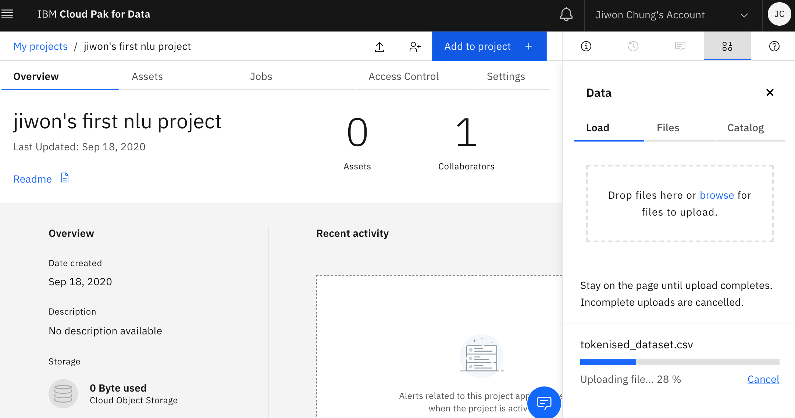


자 이제 다시 코딩 해보겠습니다.

노트북에서 우리가 넣은 Dataset을 불러오고, transform하고 해야되는데 노트북안에서 Data에 우리가 넣은 tokenised_dataset.csv 파일을 쉽게 자동으로 insert할 수 있습니다. pandas Dataframe으로 넣어볼게요.

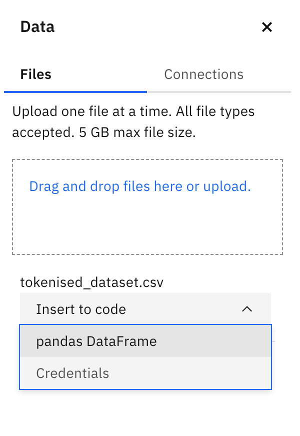

그러면 빈 셀에 자동이로 이런 코드가 작성됩니다. 정말 편리한 세상...


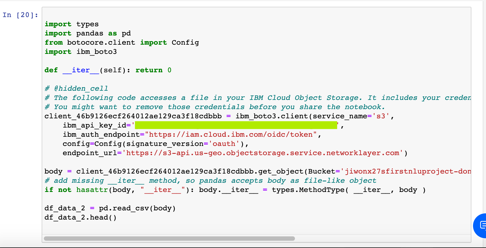


실행하면 우리가 넣은 dataset을 확인할 수 있어요.

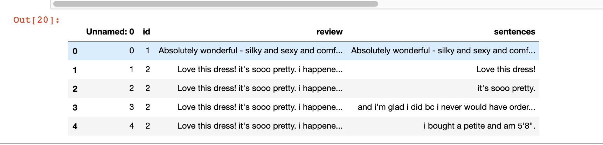

그럼 이 Dataset 문장에서 sentiment 를 추론해야겠죠? 이때 Watson의 **NLU API**를 활용할 겁니다. 

사용자 리뷰 데이터에서 Watson이 제공하는 요런 옵션들을 사용할 수 있습니다. Features, EntitiesOptions, KeywordsOptions, SentimentOptions.

우리는 EntitiesOptions와 SentimentOptions를 활용합니다. 이때 우리가 초반에 만들었던 Credential의 API key와 url endpoint를 사용합니다. 

```python
!pip install ibm_watson 
import pandas as pd
from ibm_watson import NaturalLanguageUnderstandingV1
from ibm_watson.natural_language_understanding_v1 import Features, EntitiesOptions, KeywordsOptions,SentimentOptions
from ibm_cloud_sdk_core.authenticators import IAMAuthenticator
authenticator = IAMAuthenticator('xxxxxxxxxxxxxxxxxxxxxxxxxxxxxxxxxxxxxx')

# Authentication via external config like VCAP_SERVICES
service = NaturalLanguageUnderstandingV1(
    version='2018-03-16', authenticator=authenticator)
# service.set_disable_ssl_verification(True)
service.set_service_url('XXXXXXXXXXXXXXXXXXXXXXXX')

```

이제 service를 불러왔으니, sentiment와 keyword 추출하는 함수를 만들어봅니다.

```python
def sentiment_and_keyword(st,service=service):
    return (service.analyze(text=st,features=Features(keywords=KeywordsOptions(sentiment= True,emotion= True,limit= 3),sentiment=SentimentOptions())).get_result())
  
df1['sentiment_keyword_json'] = df1.apply(lambda row : sentiment_and_keyword(str(row['sentences'])),axis = 1)
```

확인해보면 이런식으로 동작합니다.

`Absolutely wonderful - silky and sexy and comfortable`

요 sentence를 watson service에 analyze를 부탁하면,  이런 대답이 나옵니다. 99%가 positive라는 것입니다. 


```
{'usage': {'text_units': 1, 'text_characters': 53, 'features': 2},
 'sentiment': {'document': {'score': 0.998302, 'label': 'positive'}},
 'language': 'en',
 'keywords': []}
```

중간에 클라우드 메뉴 같은 것들이 익숙치 않아 헤매긴 했으나 성공적으로 실습을 마쳤습니다. 😎 (뿌듯 뿌듯)

Watson의 노트북으로 여러가지 API 를 활용해서 서비스할 수도 있겠네요... (아주 먼 훗날에..)

일단 다음에는 AutoAI 쪽 공부를 해보고 싶습니다. 후후 